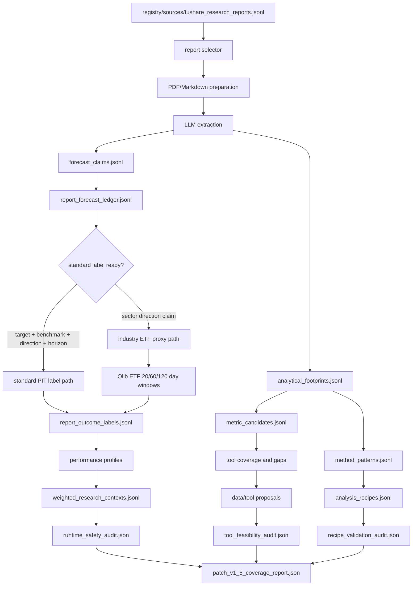
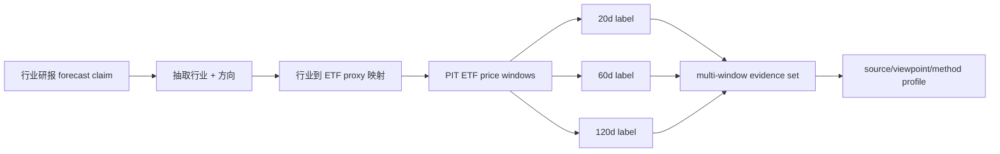

# RKE Report Intelligence 功能架构

本文档说明 RKE Report Intelligence rollout 的功能边界、数据流、artifact 结构、运行门禁和后续演化方式。它对应 `MOSAIC_RKE_REPORT_INTELLIGENCE_LOOP_PATCH_V1_5_MERGED.md` 的落地实现，并作为 `docs/plans/master_plan_v1_1.md` 中 RKE 研报智能环的实施说明。

## 1. 目标

Report Intelligence 的目标不是让研报直接变成交易信号，而是把研报中的观点、方法、变量、工具缺口和历史表现转化为可审计的 shadow assets。

核心原则：

| 原则 | 含义 |
|---|---|
| source-grounded | 所有 claim、footprint、recipe 都必须绑定原始报告或转换后的 Markdown span |
| PIT | outcome label、ETF proxy、性能统计只能使用 point-in-time 可得数据 |
| shadow-only | v1.5 阶段只产出研究辅助、权重、recipe 和 tool gap，不改变 agent runtime 决策 |
| non-LLM labeling | LLM 只能抽取观点和方向，不能判断观点对错；对错由市场数据、ETF proxy 或人工 review 产生 |
| staged promotion | 最终生产仍受 master-plan、operator-readiness、promotion gate 和 lockbox 控制 |

## 2. 总体功能架构图

```mermaid
flowchart LR
  subgraph SourceLayer["Source layer"]
    TS["Tushare research_report"]
    PDF["PDF source"]
    MD["MinerU Markdown"]
    ETF["Qlib ETF price data"]
    Gold["Manual gold review"]
  end

  subgraph ExtractionLayer["Extraction layer"]
    Select["Report selector"]
    Mineru["PDF to Markdown"]
    LLM["Local vLLM extractor"]
    Claims["Forecast claims"]
    Footprints["Analytical footprints"]
    Metrics["Metric candidates"]
    Methods["Method patterns"]
  end

  subgraph LabelLayer["Label and profile layer"]
    Ledger["Forecast ledger"]
    ETFProxy["Industry ETF proxy labeler"]
    Labels["Outcome labels"]
    SourceProfile["Source profiles"]
    ViewProfile["Viewpoint profiles"]
    MethodProfile["Method profiles"]
    Robustness["Statistical robustness audit"]
  end

  subgraph ToolingLayer["Tooling and recipe layer"]
    Coverage["Tool coverage matcher"]
    Gaps["Tool gaps"]
    DataProposal["Data acquisition proposals"]
    ToolProposal["Tool design proposals"]
    Recipes["Analysis recipes"]
    WeightedCtx["Weighted research context"]
  end

  subgraph GovernanceLayer["Governance layer"]
    RuntimeSafety["Runtime safety audit"]
    PITAudit["PIT leakage audit"]
    Provenance["Extraction provenance audit"]
    Feasibility["Tool feasibility audit"]
    RecipeAudit["Recipe validation audit"]
    PatchCoverage["v1.5 coverage report"]
  end

  subgraph PromotionLayer["Promotion layer"]
    Schema["schema-status"]
    Master["master-plan-status"]
    Operator["operator-readiness"]
    Promotion["promotion-status"]
    Lockbox["lockbox gate"]
  end

  TS --> Select
  PDF --> Mineru --> MD --> LLM
  Select --> LLM
  LLM --> Claims
  LLM --> Footprints
  Footprints --> Metrics
  Footprints --> Methods
  Claims --> Ledger
  ETF --> ETFProxy
  Ledger --> ETFProxy --> Labels
  Labels --> SourceProfile
  Labels --> ViewProfile
  Labels --> MethodProfile
  Labels --> Robustness
  Metrics --> Coverage --> Gaps
  Gaps --> DataProposal
  Gaps --> ToolProposal
  Methods --> Recipes
  SourceProfile --> WeightedCtx
  ViewProfile --> WeightedCtx
  MethodProfile --> WeightedCtx
  Claims --> Provenance
  Footprints --> Provenance
  Coverage --> Feasibility
  Recipes --> RecipeAudit
  WeightedCtx --> RuntimeSafety
  Labels --> PITAudit
  Robustness --> PatchCoverage
  RuntimeSafety --> PatchCoverage
  PITAudit --> PatchCoverage
  Provenance --> PatchCoverage
  Feasibility --> PatchCoverage
  RecipeAudit --> PatchCoverage
  PatchCoverage --> Schema
  Schema --> Master
  Master --> Operator
  Operator --> Promotion
  Promotion --> Lockbox
```



## 3. 主要模块职责

| 模块 | 入口 | 职责 | 输出 |
|---|---|---|---|
| report selection | `run_report_intelligence_refresh` | 从研报 source registry 选取样本，准备 PDF/Markdown/LLM 处理 | `report_metadata.jsonl`, `processing_status.jsonl` |
| PDF/Markdown preparation | MinerU wrapper | 下载 PDF，转换为 Markdown，记录转换状态 | local Markdown cache, processing status |
| LLM extraction | local vLLM extractor | 从 Markdown chunk 抽取 forecast claim、analytical footprint、metric、method | `forecast_claims.jsonl`, `analytical_footprints.jsonl` |
| gold and review | analytical footprint review helpers | 维护人工 footprint review 模板、导入结果、质量门禁 | `analytical_footprint_review_*.json*` |
| forecast ledger | derived refresh | 把 claim 转成可测试 ledger，检查 target/benchmark/direction/horizon | `report_forecast_ledger.jsonl`, `outcome_labeling_readiness.json` |
| ETF proxy labeler | `build_industry_etf_proxy_*` | 对行业研报观点使用行业 ETF 的 20/60/120 日窗口做 PIT 标签 | `report_outcome_labels.jsonl` |
| performance profiler | derived refresh | 汇总 source/viewpoint/method 的命中率、样本、权重 | `source_performance_profiles.jsonl`, `viewpoint_performance_profiles.jsonl`, `method_performance_profiles.jsonl` |
| tool gap loop | matcher/proposal builders | 将研报指标映射到现有工具，生成缺口和采集/工具设计 proposal | `tool_coverage_matches.jsonl`, `tool_gaps.jsonl`, `data_acquisition_proposals.jsonl`, `tool_design_proposals.jsonl` |
| recipe and retrieval | recipe builders | 生成 shadow analysis recipe 和 weighted research context | `analysis_recipes.jsonl`, `weighted_research_contexts.jsonl` |
| governance audits | audit builders | 验证 runtime no-op、PIT、provenance、统计稳健性、tool feasibility、recipe gate | `*_audit.json`, `patch_v1_5_coverage_report.json` |

### 3.1 本地运行约定

当前 RKE 本地环境已经配置过 MinerU、vLLM 和 report-intelligence 依赖。后续批量
转换研报时，应先复用既有环境，不要直接重装：

- MinerU CLI 优先使用 `.venv/bin/mineru`；如果 shell `PATH` 中已有 `mineru`，
  两者应指向同一套虚拟环境。
- PDF 到 Markdown 按当前运行约定使用 MinerU 的 `vlm-auto-engine`，也就是
  VLM/vLLM 路径。`hybrid-auto-engine` 只保留为历史 smoke 或用户明确要求的
  fallback；除非明确要连 MinerU HTTP 服务，否则不要临时改成 `pipeline`。
- 本地 vLLM/Docker 服务优先检查并启动
  `rke-vllm-qwen36-27b-160k-20260610`，该容器的 vLLM OpenAI 兼容端口为
  `8020`。
- RKE 抽取 LLM 通过 `.env` 配置，使用 `MOSAIC_RKE_VLLM_BASE_URL`、
  `MOSAIC_RKE_VLLM_MODEL` 和 API-key env vars；文档、提交和日志不得写入密钥
  明文。
- 如果只需要验证 pipeline，可先运行 `--skip-convert` 或 `--skip-llm`；真正扩大
  覆盖率时再打开 MinerU/vLLM。
- 宏观策略本地 PDF source 以 `/home/hap/Downloads/yanbaoke` 父目录内的 PDF
  为准，递归扫描 `*.pdf`，不要依赖不完整的文件清单；`宏观策略`、`其他债券研究`、
  `汇率研究`/`外汇研究`、`全球策略`、`国际宏观评论` 等宏观相邻目录进入同一
  private source corpus。汇率、外汇、人民币、美元、USD/CNY、USDCNY、美元指数
  信号归入 `宏观策略-汇率`，不归入商品/期货桶。

## 4. Artifact 架构

Report Intelligence 的主要 artifact 都集中在 `registry/report_intelligence/`：

```text
registry/report_intelligence/
├── feature_flags.json
├── report_metadata.jsonl
├── processing_status.jsonl
├── forecast_claims.jsonl
├── analytical_footprints.jsonl
├── metric_candidates.jsonl
├── method_patterns.jsonl
├── report_forecast_ledger.jsonl
├── report_outcome_labels.jsonl
├── outcome_labeling_readiness.json
├── source_performance_profiles.jsonl
├── viewpoint_performance_profiles.jsonl
├── method_performance_profiles.jsonl
├── tool_coverage_matches.jsonl
├── tool_gaps.jsonl
├── data_acquisition_proposals.jsonl
├── tool_design_proposals.jsonl
├── analysis_recipes.jsonl
├── weighted_research_contexts.jsonl
├── runtime_tool_gap_observations.jsonl
├── monitoring_report.json
├── runtime_safety_audit.json
├── pit_leakage_audit.json
├── extraction_provenance_audit.json
├── statistical_robustness_audit.json
├── tool_feasibility_audit.json
├── recipe_validation_audit.json
└── patch_v1_5_coverage_report.json
```

Schema 对应 `schemas/report_intelligence_*.schema.json`，统一由 `mosaic-rke schema-status --root .` 验证。

## 5. 数据流图



## 6. 行业 ETF proxy 标签逻辑

行业研报常见形式是“看多/看空某行业”，无法总是映射到单一股票或标准 benchmark。当前实现增加了行业 ETF proxy 口径：

1. LLM 只抽取 source-grounded 的行业观点、方向和行业实体。
2. 系统根据行业映射表选择 ETF proxy，例如有色金属到有色 ETF、银行到银行 ETF、半导体到半导体 ETF。
3. 使用 Qlib ETF PIT 数据生成 20、60、120 日固定窗口。
4. 每个窗口单独成为 outcome evidence，长期窗口不会被短期窗口覆盖。
5. 标签来源固定为 `pit_industry_etf_price_window`。
6. `llm_outcome_labeling_allowed=false`，即 LLM 不允许判断研报是否正确。



这个逻辑解决了“有色金属行业研报看多，后续有色 ETF 上涨则形成支持证据；短期下跌但长期上涨也要保留长期 evidence”的问题。

## 7. 门禁和安全边界

Report Intelligence 的输出默认是 shadow tooling，不直接进入交易决策。

```mermaid
stateDiagram-v2
  [*] --> ShadowOnly
  ShadowOnly --> ReviewBlocked: manual review gates incomplete
  ReviewBlocked --> SchemaBlocked: schema-status semantic gates fail
  SchemaBlocked --> EvolutionBlocked: schema/audit pass; evolution gate still blocked
  EvolutionBlocked --> StagedProduction: all non-lockbox gates pass
  StagedProduction --> ProductionBlocked: lockbox not opened
  ProductionBlocked --> ProductionEligible: lockbox passed

  ShadowOnly: report priors and recipes only
  ReviewBlocked: gold-set, footprint, or lockbox review pending
  SchemaBlocked: schema/audit readiness not accepted
  EvolutionBlocked: prompt evolution remains shadow-only
  StagedProduction: all non-lockbox gates pass
  ProductionBlocked: direct production forbidden
```



当前 rollout 的关键状态（2026-06-23）：

| Gate | 当前结果 |
|---|---|
| `report-intelligence --refresh-derived-only` | public-safe mode still refuses to overwrite committed derived artifacts when required private inputs are absent; with local private snapshots it recomputes public-safe summaries, but claim text, source spans, manual-review rows, PDFs, Markdown, and local macro source registries stay ignored/private |
| Markdown / extraction coverage | public summary shows the coverage gate passed: 947 selected reports have ready Markdown, 947 pass Markdown quality checks, and 945 have processed LLM extraction status; coverage strata are not currently missing |
| analytical footprint review | public summary shows 2768/2768 reviewed rows and quality gate passed, with precision-style metrics above threshold; recall remains incomplete until private human negative examples are reviewed and summarized |
| `evolution_readiness_gate` | public summary is `ready_for_shadow_evolution_candidate` with blocker count 0 across RI-EVOL and RI-MACRO checks; this does not authorize production prompt or trading impact |
| `recipe_paper_trading_summary` | public-safe summary has 4708 pre-registered shadow runs, 43 validated recipes with positive after-cost alpha, and 4665 blocked rows; dominant blockers remain insufficient effective N, missing direct PIT binding, and unimplemented shadow tools |
| industry ETF proxy labels | public PIT availability summary has 64 mappings, 63 PIT-available mappings, 109 eligible industry claims, 33 labelable claims, and 78 labelable windows; remaining gaps are aggregate-only sector mapping and PIT-history issues |
| production impact | forbidden; promotion gate allows staged/paper-trading work but direct production remains blocked because the lockbox has not been opened |

## 8. CLI 运行方式

完整刷新和派生刷新：

```bash
uv run mosaic-rke report-intelligence --root .
uv run mosaic-rke report-intelligence --root . --refresh-derived-only
```

核心验证：

```bash
uv run mosaic-rke schema-status --root . --no-write
uv run mosaic-rke master-plan-status --root . --no-write
uv run mosaic-rke operator-readiness --root . --no-write
uv run mosaic-rke promotion-status --root . --no-write
uv run mosaic-rke manifest --root .
uv run mosaic-rke validate-required --root .
```

测试建议：

```bash
MOSAIC_RKE_TMPDIR=~/tmp/mosaic-rke TMPDIR=~/tmp/mosaic-rke uv run pytest --basetemp=~/tmp/mosaic-rke/pytest-rke-full -q
uvx ruff@0.15.15 check $(git diff --name-only -- '*.py')
```

`--basetemp` 固定到 home-local 的 `~/tmp/mosaic-rke`，避免大型 registry copy 落到系统 `/tmp` tmpfs 或仓库工作区。

## 9. 与 RKE master plan 的关系

Report Intelligence 对 master plan 的贡献主要落在以下部分：

| Master plan 区域 | Report Intelligence 贡献 |
|---|---|
| Phase -1 / Phase 1 | 研报 source、gold set、claim/footprint schema、span-grounded review |
| Phase 2 | outcome label、性能 profile、统计稳健性和 after-cost/PIT 约束 |
| Phase 3 | runtime no-op、research-only guard、weighted context 只做 shadow evidence |
| Phase 4 | monitoring report、alpha decay 监控和 rollback/readiness 证据 |
| Final acceptance | C02 gold-set gate、C05/C06 runtime/confidence gate、C11 compliance gate |

## 10. 后续演化方向

当前 v1.5 仍处于 shadow-only evolution candidate 状态。后续演化继续受以下边界约束：

1. Markdown 覆盖已过当前 gate，但新增本地报告后仍要重新跑 coverage 和 extraction provenance。
2. footprint precision gate 已过；recall 必须通过私有人工 negative examples 补齐，公开 summary 只保存聚合计数和 recall estimate。
3. 行业 ETF proxy 仍要扩展映射和 PIT 可用性，缺口以 aggregate action summary 形式暴露，不能公开源报告行或 claim text。
4. analysis recipe 只能在 direct PIT binding、effective N、after-cost alpha、OOS、regime 分散和 shadow tool implementation 全部满足后进入 validated shadow set。
5. confidence impact monitor 已进入 shadow 观测，但生产决策影响仍必须保持 false，直到 promotion 和 lockbox 同时通过。
6. lockbox 未打开前，不允许任何 report-only signal 进入 production decision。
